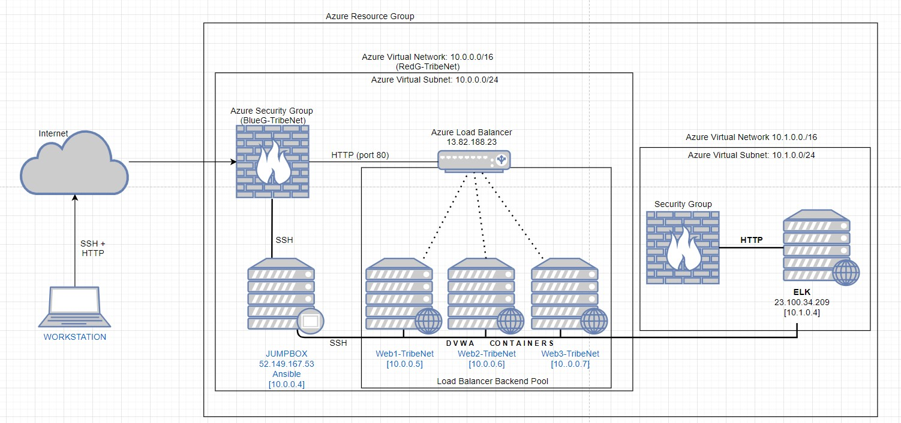

## Automated ELK Stack Deployment

The files in this repository were used to configure the network depicted below.

These files have been tested and used to generate a live ELK deployment on Azure. They can be used to either recreate the entire deployment pictured above. Alternatively, select portions of the Ansible Playbook file may be used to install only certain pieces of it, such as Filebeat.

  - install-elk.yml

This document contains the following details:
- Description of the Topology
- Access Policies
- ELK Configuration
  - Beats in Use
  - Machines Being Monitored
- How to Use the Ansible Build

### Description of the Topology

The main purpose of this network is to expose a load-balanced and monitored instance of DVWA, the D*mn Vulnerable Web Application.

Load balancing ensures that the application will be highly available and network traffic is distributed evenly amongst the servers, in addition to restricting direct access to the network.
- It helps secure the network acting as the first contact to the network by acting as filter for incoming traffic and helps distribute network traffic to its servers. Advantage of a jumpbox is it's the only mechanism that communicates to the public network(internet) while the rest of your network communicates internally, this helps secure your network and prevents intrusion by limiting access.

Integrating an ELK server allows users to easily monitor the vulnerable VMs for changes to the network and system performance.
- _TODO*: Filebeat watches for system file errors
- _TODO*:Metriceat records the system status of the machine, Uptime, CPU Usage, etc.

The configuration details of each machine may be found below.
_Note: Use the [Markdown Table Generator](http://www.tablesgenerator.com/markdown_tables) to add/remove values from the table_.

|      Name     | Function | IP Address | Operating System |
|---------------|----------|------------|------------------|
|   Jump Box    | Gateway  | 10.0.0.4   | Linux            |
| Web1-TribeNet | Server   | 10.0.0.5   | Linux            |
| Web2-TribeNet | Server   | 10.0.0.6   | Linux            |
| Web3-TribeNet | Server   | 10.0.0.7   | Linux            |

### Access Policies

The machines on the internal network are not exposed to the public Internet. 

Only the virtual machine can accept connections from the Internet. Access to this machine is only allowed from the following IP addresses:
75.72.97.117

Machines within the network can only be accessed by SSH.
Only machine able to access the ELK System is my personal PC's IP Address: 75.72.97.117.

A summary of the access policies in place can be found in the table below.

| Name          | Publicly Accessible | Allowed IP Addresses                      |
|---------------|---------------------|-------------------------------------------|
|    Jump Box   | Yes                 | 75.72.97.117 10.0.0.5 10.0.0.6 10.0.0.7   |
| Web1-TribeNet | No                  | 10.0.0.4                                  |
| Web2-TribeNet | No                  | 10.0.0.4                                  |
| Web3-TribeNet | No                  | 10.0.0.4                                  |

### Elk Configuration

Ansible was used to automate configuration of the ELK machine. No configuration was performed manually, which is advantageous because...
- The main advantage of using ansible is that it can be deployed on multiple servers through automating with a single configuration file versus manually input each command and waiting for its results and completion.

The playbook implements the following tasks:
- It will push out the play to the designated VM you added on your host and start installing Docker and Python3.
- Once those are install the configuration also allocates more memory usage.
- The configuration will then download the ELK image container and launch it. As well as designate the port and turn on it's services.

The following screenshot displays the result of running `docker ps` after successfully configuring the ELK instance.

### Target Machines & Beats
This ELK server is configured to monitor the following machines:
10.0.0.5
10.0.0.6 
10.0.0.7

We have installed the following Beats on these machines:
filebeats
metricbeats

These Beats allow us to collect the following information from each machine:
Filebeat collects and logs system datas in cases there are any errors or disruption, the log would collect it. Metribeat provides data on system performance and usage such as CPU, memory ,and system uptime.

### Using the Playbook
In order to use the playbook, you will need to have an Ansible control node already configured. Assuming you have such a control node provisioned: 

SSH into the control node and follow the steps below:
- Copy the Install-Elk Template file to /etc/ansible.
- Update the hosts file to include file to include... Your elk server
- Run the playbook, and navigate to ELK server to check that the installation worked as expected.

install-elk.yml is the playbook and should be copied into /etc/ansible/ directory

You would update the host file and add a group such as webserver or elk. On your play playbook you would input which group(machines) you would want to run the playbook on and then execute it.

To navigate to check if your elk server is running goto http://[your.VM.IP]:5601/app/kibana

