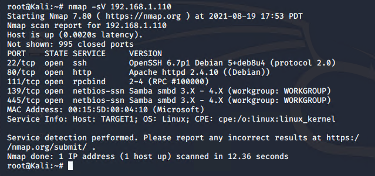

# Red Team: Summary of Operations

## Table of Contents
- Exposed Services
- Critical Vulnerabilities
- Exploitation

### Exposed Services
_TODO: Fill out the information below._

Nmap scan results for each machine reveal the below services and OS details:

```bash
$ nmap -sV 192.168.1.110
```


This scan identifies the services below as potential points of entry:
- Target 1
  - List of
  - Exposed Services

_TODO: Fill out the list below. Include severity, and CVE numbers, if possible._

The following vulnerabilities were identified on each target:
- Target 1
  - Open Port 22- SSH
  - Open Port 80 - HTTP
  - Open Port 111 - rpc
  - Open Port 445 - SMB
  - Open Port 139 - SMB

_TODO: Include vulnerability scan results to prove the identified vulnerabilities._

```bash
$ nmap -sV 192.168.1.110
```

### Exploitation
_TODO: Fill out the details below. Include screenshots where possible._

The Red Team was able to penetrate `Target 1` and retrieve the following confidential data:
- Target 1
  - `flag1.txt`: _TODO: Insert `flag1.txt` hash value_
    - **Exploit Used**
      - _TODO: Used
      - _TODO: grep "flag1" /var/www/html/*
  - `flag2.txt`: _TODO: Insert `flag2.txt` hash value_
    - **Exploit Used**
      - _TODO: 
      - _TODO: find flag *
